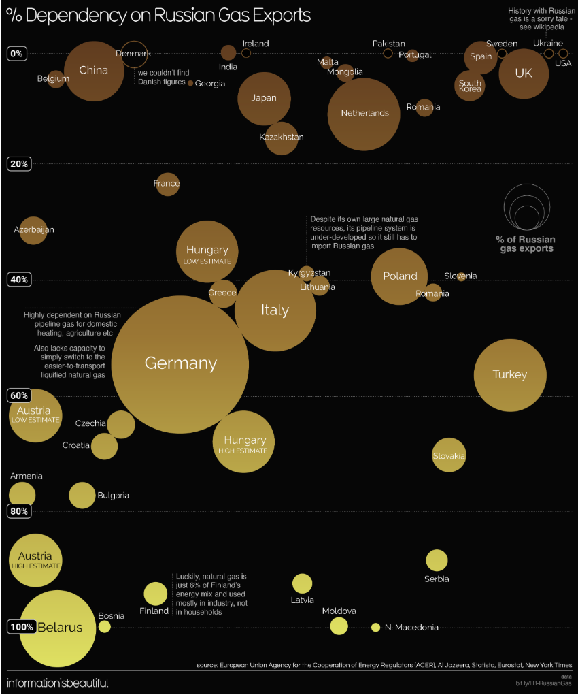

```{r}
#| label: setup
#| include: false
library(knitr)
library(readr)
library(readxl)
library(dplyr)
library(tidyr)
library(stringr)
library(ggplot2)
library(ggrepel)
library(scales)
```


## The Original Bubble Chart {.unnumbered .unlisted}

<hr>

:::: columns
::: {.column width="55%"}
{.border-img fig-alt="Bubble chart showing dependency on Russian gas exports" width="40%"}
:::
::: {.column width="45%"}

**Source:** Information is Beautiful (2022)

The chart encodes **three dimensions**:

- **Y-axis:** % dependency on Russian gas
- **Bubble size:** Share of Russia's total gas exports
- **X-axis:** Alphabetical order (no analytical meaning)

Published during the 2022 Russia-Ukraine war, it asks: *which countries could afford to sanction Russia?*
:::
::::


## The Story Behind the Data {style="font-size: 0.95em;"}

<hr>

The original visualization poses a question with real geopolitical stakes.

When Russia invaded Ukraine in February 2022, European nations faced an impossible dilemma:

- **Sanction Russia** — but risk heating shortages, industrial shutdowns, and political crises
- **Continue buying gas** — but fund the very war machine they opposed

. . .

The stakes were not equal. Some nations could act at little cost; others faced existential energy crises.

. . .

**Our improvement adds a fourth dimension** — geopolitical alignment — to reveal the fault line where the most structurally dependent countries were often the same ones most committed to opposing Russia.


## Strengths of the Original

<hr>

:::: columns
::: {.column width="50%"}
**Dual encoding of key metrics**

Bubble size and Y-axis position work together to simultaneously show both a country's importance to Russia as a customer and Russia's leverage over that country.

. . .

**Contextual annotations**

Inline annotations for notable countries (Germany, Finland) provide qualitative context that enriches interpretation beyond raw numbers.
:::
::: {.column width="50%"}

**Direct labeling**

Country labels placed directly on bubbles eliminate the need for a separate legend, improving readability for general audiences.
:::
::::


## Weaknesses Identified {style="font-size: 0.8em;"}

<hr>

We identified **12 weaknesses** in the original visualization, grouped into four categories:

:::: columns
::: {.column width="50%"}
**Encoding & Layout Issues**

1. X-axis is alphabetical — no analytical meaning, risks false inferences
2. Colour redundantly encodes the Y-axis dependency variable
3. Large bubbles span wide vertical ranges, obscuring precise dependency values
4. Distinction between solid and hollow circles is unexplained

**Data Gaps**

5. Uses pre-2022 figures, missing post-invasion energy shifts
6. No absolute volume data (bcm) — cannot assess true economic stakes
:::
::: {.column width="50%"}
**Clarity & Definition Issues**

7. "% dependency" is undefined — unclear if it means share of gas consumption, energy mix, or imports
8. Y-axis 0% is ambiguous — could mean zero imports or missing data
9. Difference between "% dependency" and "% of Russian gas exports" is confusing
10. "HIGH/LOW ESTIMATE" labels are undefined

**Presentation Issues**

11. Bubble overlap and label illegibility in the 0–20% cluster
12. Dual entries for Hungary/Austria create clutter without statistical rigor
:::
::::


## How Our 3 Improvements Address the 12 Weaknesses {style="font-size: 0.8em;"}

<hr>

```{r}
#| echo: false
#| eval: true

mapping <- tribble(
  ~Improvement, ~`Weakness Addressed`, ~Mechanism,
  "1. Analytical X-axis (log-scaled bcm)", "W1: Alphabetical X-axis has no meaning", "X-axis now carries analytical weight — import volume in bcm/yr",
  "1. Analytical X-axis (log-scaled bcm)", "W6: No absolute volume data", "Absolute volumes are directly readable from the X-axis",
  "1. Analytical X-axis (log-scaled bcm)", "W3: Large bubbles obscure precise values", "Log scale compresses large importers, spreads small ones",
  "1. Analytical X-axis (log-scaled bcm)", "W11: Bubble overlap in low-dependency cluster", "Countries separate along a meaningful dimension, reducing clustering",
  "2. Colour encodes geopolitical alignment", "W2: Colour redundantly encodes Y-axis", "Colour now encodes a genuinely new 4th dimension",
  "2. Colour encodes geopolitical alignment", "W5: Pre-2022 data misses policy shifts", "Geopolitical alignment adds post-invasion context",
  "2. Colour encodes geopolitical alignment", "W9: Two metrics easily confused", "Distinct visual channels for each metric reduce confusion",
  "2. Colour encodes geopolitical alignment", "W4: Solid vs hollow circles unclear", "All countries use same filled point; groups distinguished by colour",
  "3. Consolidate uncertainty estimates", "W10: HIGH/LOW ESTIMATE undefined", "Replaced with single midpoint estimate, flagged in the data",
  "3. Consolidate uncertainty estimates", "W12: Dual entries clutter the chart", "One point per country; no visual duplication",
  "3. Consolidate uncertainty estimates", "W7: '% dependency' definition unclear", "Axis labels and subtitle explicitly define the metric",
  "3. Consolidate uncertainty estimates", "W8: Y-axis 0% ambiguity", "Subtitle clarifies 0% = no Russian gas imports"
)

kable(mapping, col.names = c("Improvement", "Weakness Addressed", "How It Helps"))
```


## Data Sources

<hr>

:::: columns
::: {.column width="50%"}
**Eurostat `nrg_ti_gas`**

- Annual natural gas trade statistics
- 44 countries, 2015–2024
- Import volumes in million cubic metres
- Filtered to 2021 (last pre-invasion year)
- Partner = Russia and Total

[Eurostat Data Browser](https://ec.europa.eu/eurostat/databrowser/view/nrg_ti_gas/default/table?lang=en){target="_blank"}
:::
::: {.column width="50%"}
**Ukraine-Russia War Graphics**

- Google Sheet by *Information is Beautiful*
- % dependency on Russian gas supply
- % share of Russia's total gas exports
- Geopolitical stance (5 categories)

[informationisbeautiful.net](https://informationisbeautiful.net/visualizations/ukraine-russia-war-infographics-data-visuals/){target="_blank"}
:::
::::


## Data Pipeline Overview

<hr>

```{r}
#| label: pipeline-diagram
#| echo: false
#| eval: true
#| fig-width: 12
#| fig-height: 4

pipeline <- data.frame(
  step = factor(c("Raw Data", "Clean", "Derive", "Merge", "Visualize"),
                levels = c("Raw Data", "Clean", "Derive", "Merge", "Visualize")),
  x = 1:5,
  y = rep(0, 5),
  detail = c(
    "Eurostat CSV\nWar Graphics XLSX",
    "Filter 2021\nStandardise names\nRemove aggregates",
    "Consolidate\nestimates\nSimplify alignment",
    "left_join() on\ncountry name",
    "ggplot2\nbubble chart"
  )
)

ggplot(pipeline, aes(x = x, y = y)) +
  geom_segment(aes(x = x + 0.3, xend = x + 0.7, y = 0, yend = 0),
               arrow = arrow(length = unit(0.2, "cm")),
               colour = "#6aa8f5", linewidth = 1,
               data = pipeline |> filter(x < 5)) +
  geom_point(size = 18, colour = "#6aa8f5", shape = 21,
             fill = "#1a1a2e", stroke = 2) +
  geom_text(aes(label = step), colour = "#6aa8f5",
            fontface = "bold", size = 3.5) +
  geom_text(aes(label = detail, y = -0.5), colour = "grey70",
            size = 2.8, lineheight = 1.1) +
  theme_void() +
  theme(
    plot.background = element_rect(fill = "transparent", colour = NA),
    panel.background = element_rect(fill = "transparent", colour = NA)
  ) +
  coord_cartesian(ylim = c(-1.2, 0.8))
```


## Step 1–2: Load and Clean Data {style="font-size: 0.8em;"}

<hr>

```{r}
#| label: load-clean
#| echo: true
#| eval: true
#| message: false
#| warning: false

# --- Read raw data ---
eurostat_raw <- read_csv("data/nrg_ti_gas__custom_20384524_linear.csv",
                         show_col_types = FALSE)

war_dep <- read_xlsx("data/Ukraine-Russia_War_Graphics.xlsx",
                     sheet = "% dependency on Russian Gas (en")
war_support <- read_xlsx("data/Ukraine-Russia_War_Graphics.xlsx",
                         sheet = "Who Supports Russia")
```

. . .

```{r}
#| echo: true
#| eval: true
#| message: false

# --- Clean Eurostat: filter to 2021, remove aggregates, pivot ---
aggregate_geos <- c(
  "European Union - 27 countries (from 2020)",
  "Euro area – 20 countries (2023-2025)",
  "Euro area – 21 countries (from 2026)"
)

eurostat_clean <- eurostat_raw |>
  filter(TIME_PERIOD == 2021, !(geo %in% aggregate_geos)) |>
  select(geo, partner, OBS_VALUE) |>
  pivot_wider(names_from = partner, values_from = OBS_VALUE, values_fill = 0)

names(eurostat_clean) <- c("country", "imports_russia_mcm", "imports_total_mcm")

eurostat_clean <- eurostat_clean |>
  mutate(
    imports_russia_bcm = imports_russia_mcm / 1000,
    imports_total_bcm  = imports_total_mcm / 1000,
    country = case_when(
      country == "Türkiye" ~ "Turkey",
      country == "Bosnia and Herzegovina" ~ "Bosnia",
      TRUE ~ country
    )
  )
```


## Step 3: Derive Variables — Consolidate Estimates {style="font-size: 0.8em;"}

<hr>

```{r}
#| label: derive-dep
#| echo: true
#| eval: true

# --- Clean dependency data: consolidate dual estimates ---
war_dep_clean <- war_dep |>
  select(country = 1, note = 2, dep_pct = 3, export_pct = 4) |>
  filter(!is.na(country)) |>
  mutate(dep_pct = as.numeric(dep_pct), export_pct = as.numeric(export_pct))

# Consolidate HIGH/LOW estimates into midpoint (Improvement 3)
dual <- war_dep_clean |>
  filter(str_detect(note, "estimate", negate = FALSE)) |>
  group_by(country) |>
  summarise(dep_pct = mean(dep_pct, na.rm = TRUE),
            export_pct = first(export_pct),
            is_estimate = TRUE, .groups = "drop")

single <- war_dep_clean |>
  filter(is.na(note) | !str_detect(note, "estimate")) |>
  mutate(is_estimate = FALSE) |>
  select(country, dep_pct, export_pct, is_estimate)

war_dep_final <- bind_rows(single, dual)
```

. . .

::: {.callout-note style="width: 80%;"}
Countries with dual HIGH/LOW estimates (Hungary, Austria, Romania) are consolidated into a single midpoint value and flagged with `is_estimate = TRUE`. This addresses **W10** and **W12**.
:::


## Step 4: Clean Geopolitical Alignment & Merge {style="font-size: 0.8em;"}

<hr>

```{r}
#| label: derive-merge
#| echo: true
#| eval: true

# --- Clean geopolitical alignment: simplify to 3 categories ---
war_support_clean <- war_support |>
  select(country = 1, response = 2) |>
  filter(!is.na(response), response != "") |>
  mutate(
    geopolitical_alignment = case_when(
      response %in% c("PRO RUSSIA", "LEANS RUSSIA") ~ "Pro-Russia / Leaning",
      response == "CONDEMNS RUSSIA"                  ~ "Opposes Russia",
      response %in% c("NEUTRAL", "UNHAPPY")          ~ "Neutral / Non-aligned",
      TRUE ~ NA_character_
    ),
    country = ifelse(country == "Bosnia & Herzegovina", "Bosnia", country)
  ) |>
  filter(!is.na(geopolitical_alignment)) |>
  select(country, geopolitical_alignment)
```

. . .

```{r}
#| echo: true
#| eval: true

# --- Merge all three datasets ---
viz_data <- war_dep_final |>
  left_join(eurostat_clean |> select(country, imports_russia_bcm), by = "country") |>
  left_join(war_support_clean, by = "country") |>
  filter(!is.na(dep_pct)) |>
  mutate(
    geopolitical_alignment = replace_na(geopolitical_alignment, "Unknown"),
    geopolitical_alignment = factor(geopolitical_alignment,
      levels = c("Opposes Russia", "Neutral / Non-aligned",
                 "Pro-Russia / Leaning", "Unknown")),
    dep_pct_display    = dep_pct * 100,
    export_pct_display = export_pct * 100
  )
```


## Final Dataset Preview {.smaller}

<hr>

```{r}
#| echo: true
#| eval: true

viz_data |>
  arrange(desc(dep_pct)) |>
  select(country, dep_pct_display, export_pct_display,
         imports_russia_bcm, geopolitical_alignment, is_estimate) |>
  head(15)
```


## Improvement 1: Analytical X-Axis {style="font-size: 0.95em;"}

<hr>

**Replace alphabetical X-axis with log-scaled absolute import volume (bcm/yr)**

This converts the chart from a 2-variable visualisation with arbitrary layout into a true **3-variable scatter plot**:

- **X-axis** = absolute gas volume imported from Russia (bcm/yr, log scale)
- **Y-axis** = import dependency (%)
- **Bubble size** = share of Russia's total gas exports (%)

. . .

The log scale prevents Germany and Italy from compressing smaller nations into an unreadable cluster.

::: {.callout-note style="width: 80%;"}
**Weaknesses addressed:** W1 (alphabetical X-axis), W3 (imprecise reading), W6 (no absolute volume), W11 (bubble overlap)
:::


## Improvement 2: Geopolitical Colour Encoding {style="font-size: 0.95em;"}

<hr>

**Map colour to geopolitical alignment instead of dependency**

The original chart's colour gradient (brown to gold) redundantly reinforced the Y-axis. Our improvement replaces this with a **genuinely new fourth analytical dimension**.

. . .

Three alignment categories:

- [**Opposes Russia**]{style="color: #4FC3F7;"} — Countries that condemned the invasion
- [**Neutral / Non-aligned**]{style="color: #FFD54F;"} — Countries that remained neutral or expressed mild disapproval
- [**Pro-Russia / Leaning**]{style="color: #EF5350;"} — Countries that supported or leaned toward Russia

::: {.callout-note style="width: 80%;"}
**Weaknesses addressed:** W2 (redundant colour), W4 (solid vs hollow circles), W5 (missing geopolitical context), W9 (metric confusion)
:::


## Improvement 3: Consolidated Uncertainty {style="font-size: 0.95em;"}

<hr>

**Replace dual HIGH/LOW entries with single midpoint estimates**

Hungary, Austria, and Romania each appeared twice in the original chart. We consolidate these into a single data point using the midpoint of the two estimates, and flag them with a distinct marker.

. . .

This preserves the acknowledgment of data uncertainty while reducing visual clutter and avoiding the misleading impression that a country appears twice.

::: {.callout-note style="width: 80%;"}
**Weaknesses addressed:** W7 (undefined metrics), W8 (Y-axis ambiguity), W10 (undefined estimates), W12 (dual entry clutter)
:::


## The Improved Bubble Chart

<hr>

```{r}
#| label: main-viz
#| echo: true
#| eval: true
#| fig-width: 13
#| fig-height: 7.5
#| fig-dpi: 150

# Filter to countries that have Eurostat import volume data
viz_plot_data <- viz_data |>
  filter(!is.na(imports_russia_bcm), imports_russia_bcm > 0)

# Define colour palette for geopolitical alignment
alignment_colours <- c(
  "Opposes Russia"         = "#4FC3F7",
  "Neutral / Non-aligned"  = "#FFD54F",
  "Pro-Russia / Leaning"   = "#EF5350",
  "Unknown"                = "#9E9E9E"
)

ggplot(viz_plot_data,
       aes(x = imports_russia_bcm,
           y = dep_pct_display,
           size = export_pct_display,
           colour = geopolitical_alignment)) +
  geom_point(alpha = 0.75) +
  geom_point(data = viz_plot_data |> filter(is_estimate),
             shape = 1, colour = "white", stroke = 0.8,
             show.legend = FALSE) +
  geom_text_repel(
    aes(label = country),
    size = 2.8,
    colour = "grey85",
    max.overlaps = 25,
    segment.colour = "grey50",
    segment.size = 0.3,
    box.padding = 0.4,
    point.padding = 0.3,
    seed = 42
  ) +
  scale_x_log10(
    labels = label_number(suffix = ""),
    breaks = c(0.01, 0.1, 1, 10, 100)
  ) +
  scale_size_area(
    name = "Share of Russia's\ngas exports (%)",
    max_size = 18,
    breaks = c(1, 5, 10, 20)
  ) +
  scale_colour_manual(
    name = "Geopolitical alignment",
    values = alignment_colours
  ) +
  labs(
    title = "Dependency on Russian Gas vs. Import Volume",
    subtitle = paste0(
      "Y-axis: share of country's natural gas supply sourced from Russia ",
      "(2021 pre-invasion data)\n",
      "X-axis: absolute Russian gas imports in billion cubic metres (log scale)\n",
      "Circled points indicate consolidated estimates from multiple sources"
    ),
    x = "Gas imports from Russia (bcm/yr, log scale)",
    y = "Dependency on Russian gas (%)",
    caption = "Sources: Eurostat nrg_ti_gas (2021), Information is Beautiful"
  ) +
  theme_dark(base_size = 13) +
  theme(
    plot.background    = element_rect(fill = "#0d1117", colour = NA),
    panel.background   = element_rect(fill = "#161b22", colour = NA),
    panel.grid.major   = element_line(colour = "#30363d", linewidth = 0.3),
    panel.grid.minor   = element_blank(),
    legend.background  = element_rect(fill = "#0d1117", colour = NA),
    legend.key         = element_rect(fill = "#161b22", colour = NA),
    legend.text        = element_text(colour = "grey80", size = 9),
    legend.title       = element_text(colour = "grey90", size = 10),
    plot.title         = element_text(colour = "white", size = 16, face = "bold"),
    plot.subtitle      = element_text(colour = "grey70", size = 10,
                                       lineheight = 1.3),
    plot.caption       = element_text(colour = "grey50", size = 8),
    axis.text          = element_text(colour = "grey80"),
    axis.title         = element_text(colour = "grey90"),
    legend.position    = "right"
  ) +
  guides(
    colour = guide_legend(override.aes = list(size = 5, alpha = 1)),
    size   = guide_legend(override.aes = list(colour = "grey70"))
  )
```


## Supplementary: All Countries {style="font-size: 0.95em;"}

<hr>

```{r}
#| label: full-bar-chart
#| echo: true
#| eval: true
#| fig-width: 13
#| fig-height: 7.5
#| fig-dpi: 150

viz_all <- viz_data |>
  arrange(desc(dep_pct_display)) |>
  mutate(country = factor(country, levels = country))

ggplot(viz_all |> head(30),
       aes(x = dep_pct_display,
           y = country,
           fill = geopolitical_alignment)) +
  geom_col(alpha = 0.85, width = 0.7) +
  geom_text(aes(label = paste0(round(dep_pct_display, 0), "%")),
            hjust = -0.1, colour = "grey80", size = 3) +
  scale_fill_manual(
    name = "Geopolitical alignment",
    values = alignment_colours
  ) +
  labs(
    title = "Top 30 Countries by Dependency on Russian Gas",
    subtitle = paste0(
      "Share of country's natural gas supply sourced from Russia\n",
      "Geopolitical alignment reveals the structural contradiction ",
      "between energy needs and foreign policy"
    ),
    x = "Dependency on Russian gas (%)",
    y = NULL,
    caption = "Sources: Information is Beautiful, Economist Intelligence Unit"
  ) +
  scale_x_continuous(expand = expansion(mult = c(0, 0.15))) +
  theme_dark(base_size = 12) +
  theme(
    plot.background    = element_rect(fill = "#0d1117", colour = NA),
    panel.background   = element_rect(fill = "#161b22", colour = NA),
    panel.grid.major.y = element_blank(),
    panel.grid.major.x = element_line(colour = "#30363d", linewidth = 0.3),
    panel.grid.minor   = element_blank(),
    legend.background  = element_rect(fill = "#0d1117", colour = NA),
    legend.key         = element_rect(fill = "#161b22", colour = NA),
    legend.text        = element_text(colour = "grey80"),
    legend.title       = element_text(colour = "grey90"),
    plot.title         = element_text(colour = "white", size = 16, face = "bold"),
    plot.subtitle      = element_text(colour = "grey70", size = 10,
                                       lineheight = 1.3),
    plot.caption       = element_text(colour = "grey50", size = 8),
    axis.text          = element_text(colour = "grey80"),
    axis.title         = element_text(colour = "grey90"),
    legend.position    = "bottom"
  ) +
  guides(fill = guide_legend(nrow = 1))
```


## Key Findings {style="font-size: 0.8em;"}

<hr>

:::: columns
::: {.column width="50%"}
**The Dependency–Alignment Paradox**

Countries in the upper-right of our bubble chart face the sharpest dilemma: high dependency *and* strong opposition to Russia.

- **Germany** — Russia's largest customer (55 bcm/yr, 55% dependent) yet firmly condemns the invasion
- **Finland** — 94% dependent but cut Russian gas entirely after joining NATO
- **Austria** — ~79% dependent (consolidated estimate) yet part of EU sanctions
:::
::: {.column width="50%"}
**Pro-Russia nations and energy leverage**

- **Belarus** (100%), **Moldova** (100%) — total dependency correlates with political alignment or lack of alternatives
- **Serbia** (89%) — high dependency and geopolitical leaning toward Russia
- **Hungary** (~51% consolidated) — officially condemns Russia but blocked EU sanctions repeatedly

. . .

**Small but free**

- **Belgium** (5%), **France** (24%), **Spain** (2%) — low dependency enabled swift sanctions without energy crises
:::
::::


## Conclusion

<hr>

Our improved visualization transforms the original from a **2-variable chart with decorative elements** into a **4-variable analytical tool** that reveals the structural contradictions behind Europe's response to the invasion.

. . .

**Three improvements, twelve weaknesses addressed:**

1. **Analytical X-axis** → eliminates false inferences, adds absolute volume data
2. **Geopolitical colour** → replaces redundant encoding with a genuinely new dimension
3. **Consolidated estimates** → reduces clutter, preserves honesty about uncertainty

. . .

The key insight: *the countries most committed to opposing Russia were often the same ones most structurally dependent on its energy — and many chose to act anyway.*


## Work Distribution {.smaller}

<hr>

| Member | Proposal Role | Final Contribution |
|--------|--------------|-------------------|
| **Kathy** | Data Acquisition | Data acquisition, source verification, project structure |
| **Yong Ying** | Data Cleaning | Eurostat filtering, country name standardisation |
| **Ellie** | Merging & Variables | Dataset merging, derived variables, estimate consolidation |
| **Ignatius** | Visualisation | ggplot2 bubble chart, bar chart, theme design |
| **Michael** | Analysis & Docs | Critical analysis, weakness-improvement mapping, documentation |
| **All** | — | Presentation slides preparation, MP4 recording |


## References {.unnumbered}

<hr>

- Eurostat. (2026). *Natural gas trade by partner country* `[nrg_ti_gas]`. European Commission.
  <https://ec.europa.eu/eurostat/databrowser/view/nrg_ti_gas/default/table?lang=en>

- McCandless, D. et al. (2022). *Ukraine-Russia War — Infographics & Data Visualisations*. Information is Beautiful.
  <https://informationisbeautiful.net/visualizations/ukraine-russia-war-infographics-data-visuals/>

- Economist Intelligence Unit. (2022). *Russia-Ukraine conflict response tracker*.
  <https://www.economist.com/graphic-detail/2022/03/05/which-countries-have-imposed-sanctions-on-russia>


## {.unnumbered .unlisted}

<hr>

::: {style="text-align: center; padding-top: 200px; font-size: 1.5em;"}
**Thank you**

Questions?
:::
